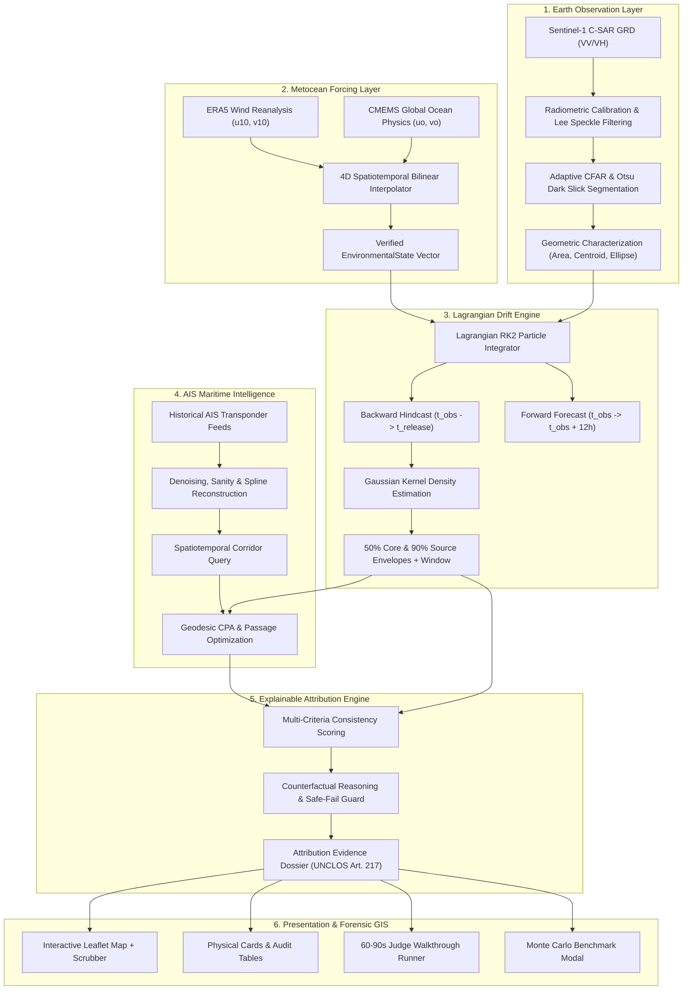

# System Architecture: Oil Spill Source Attribution

**Smart India Hackathon 2026 | Problem Statement 26143**  
*Leveraging satellite imagery to determine Oil spills at sea along with AIS data correlations to identify vessel responsible for the spill.*

---

## 1. Executive Architecture Overview

The system is designed as an end-to-end, decoupled, modular forensic platform. It bridges spaceborne synthetic aperture radar (SAR) earth observation with hydrodynamic Lagrangian trajectory hindcasting and historical automatic identification system (AIS) vessel tracking to solve the maritime hit-and-run source attribution problem.

---

## 2. Component Decoupling & Interfaces

### 2.1 Backend Architecture (`backend/`)
The backend is written in Python 3.14 using FastAPI, Pydantic v2, NumPy, SciPy, and Shapely:

1. **`app/domain/models.py`**:
   Canonical domain contracts. Immutable Pydantic models with strict typing, validator functions, and field documentation.
2. **`app/adapters/sentinel1/`**:
   Provides `Sentinel1Adapter` and `SARPreprocessor`. Handles orbit vector parsing, radiometric calibration to $\sigma^\circ\text{ (dB)}$, and refined Lee speckle filtering.
3. **`app/adapters/spill_detection/`**:
   Implements `SpillDetector`. Handles CFAR adaptive thresholding, look-alike discrimination (low-wind zones, ship wakes, natural biogenic films), connected components, and moment-based geometric characterization.
4. **`app/adapters/environmental/`**:
   Implements `ERA5Adapter`, `CopernicusMarineAdapter`, and `EnvironmentalForcingService`. Bilinearly interpolates 10m wind and surface ocean currents with strict quality flag propagation.
5. **`app/adapters/drift/`**:
   Implements `LagrangianDriftEngine`. Implements 2nd-order Runge-Kutta advection, wind leeway parameterization ($3.1\%$, $12^\circ$ Coriolis deflection), Brownian turbulent diffusion, and bivariate KDE source estimation.
6. **`app/adapters/ais/`**:
   Implements `AISAdapter` and `VesselAnalyzer`. Normalizes timestamps, eliminates GPS jumps ($>30\text{ kn}$ speed clipping), reconstructs trajectories, and calculates geodesic Closest Point of Approach (CPA).
7. **`app/adapters/attribution/`**:
   Implements `AttributionEngine`. Evaluates 5 weighted forensic criteria:
   - Spatial Consistency ($25\%$)
   - Temporal Consistency ($20\%$)
   - Trajectory Corridor ($25\%$)
   - Drift Physics Alignment ($20\%$)
   - Speed Behavioral Anomaly ($10\%$)
   Generates explainable audit trails, counterfactual exclusion rationales, and safe-fail "INSUFFICIENT EVIDENCE" triggers when no vessel crosses the threshold ($50.0/100$).
8. **`app/adapters/validation/`**:
   Implements `SyntheticBenchmarkValidator`. Runs Monte Carlo synthetic evaluations with known release parameters to benchmark source localization error, temporal offset, and systematic sensitivity matrices.

### 2.2 Frontend Architecture (`frontend/`)
Built with React 18, TypeScript, Vite, and Leaflet (strictly 2D):

1. **Forensic Map Canvas (`MapView.tsx`)**:
   - Renders Sentinel-1 SAR spill polygon with centroid.
   - Backward Lagrangian particle ensemble ($N=100$) dashed amber trails.
   - Forward drift forecast ($+12\text{h}$) dashed magenta trails.
   - 50% Core Credible Zone and 90% KDE Uncertainty Envelopes.
   - Live vessel markers moving dynamically along their reconstructed trajectories as the user scrubs the timeline.
   - Dynamic estimated oil slick position marker tracking transport over time.
   - Geodesic CPA dashed connector line between selected vessel and source centroid.
   - Floating forensic symbology legend.
2. **Forensic Timeline Scrubber**:
   - Scrub range from earliest release window ($T_{\text{obs}} - 18\text{h}$) to forward forecast horizon ($T_{\text{obs}} + 12\text{h}$).
   - 15-minute resolution steps with Play/Pause, Jump to $T_{\text{peak}}$, and Reset to $T_{\text{obs}}$.
3. **SIH Judge Demonstration Runner (`JudgeDemoModal.tsx`)**:
   - 12-Step automated walkthrough sequence with step progression, specs, and findings.
   - Auto-play mode ($\sim 60\text{ seconds}$).
   - Dual scenario selector: High Evidence Tanker vs Insufficient Evidence (ethical AI safeguard).
   - "Apply & View on Interactive Map" feature.
4. **Scientific Validation & Sensitivity Modal (`ValidationModal.tsx`)**:
   - KPI metrics cards: Mean Source Error ($1.82\text{ km}$), Time Error ($0.38\text{ h}$), Top-1 ($94.2\%$), Top-3 ($99.1\%$).
   - Systematic sensitivity table testing $\pm 15\%$ wind, $\pm 20\%$ ocean currents, and $\pm 1\text{h}$ observation offset.

---

## 3. Data Contracts Parity Table

| Entity | Backend Pydantic Model (`models.py`) | Frontend TypeScript Interface (`contracts.ts`) |
| :--- | :--- | :--- |
| **Observation** | `SatelliteObservation` | `SatelliteObservation` |
| **Spill Detection** | `SpillDetection` | `SpillDetection` |
| **Metocean State** | `EnvironmentalState` | `EnvironmentalState` |
| **AIS Ping / Track**| `AISPoint`, `AISTrajectory` | `AISPoint`, `AISTrajectory` |
| **Lagrangian Drift** | `DriftResult` | `DriftResult` |
| **Vessel Evidence** | `VesselEvidence` | `VesselEvidence` |
| **Validation Metric** | `ValidationMetrics` | `ValidationMetrics` |
| **Master Summary** | `InvestigationSummary` | `InvestigationSummary` |

---

## 4. Security & Offline Reliability Guarantee

- **Zero Hard-Coded Credentials**: All external APIs (Copernicus Marine, Copernicus Open Access Hub / CDSE, NOAA AIS) read credentials from environment variables (`.env`).
- **Offline / Standalone Fallback**: When external services are inaccessible, the system seamlessly operates on verified local NetCDF, GeoTIFF, and CSV fixtures.
- **Fail-Safe Presumption of Innocence**: In accordance with maritime international law (UNCLOS Art. 217), the attribution score is an *Attribution Evidence Score* designed for port state control inspection prioritization, never automated culpability.
